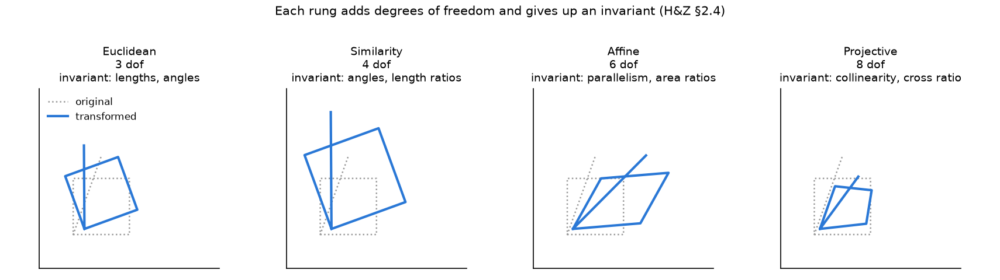
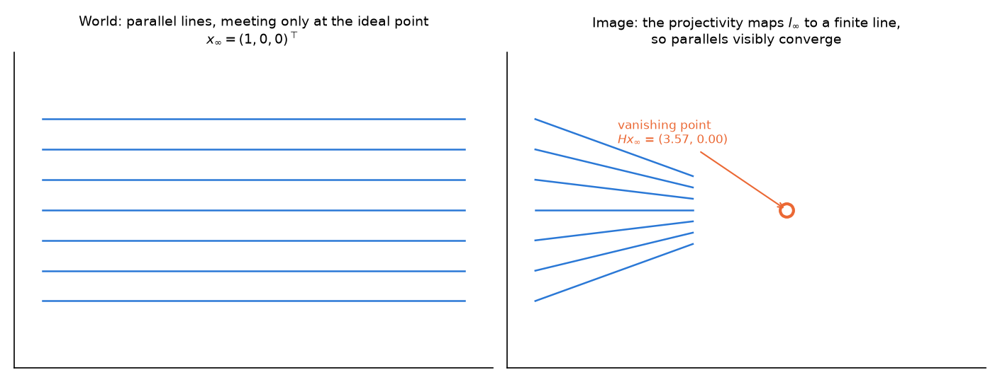
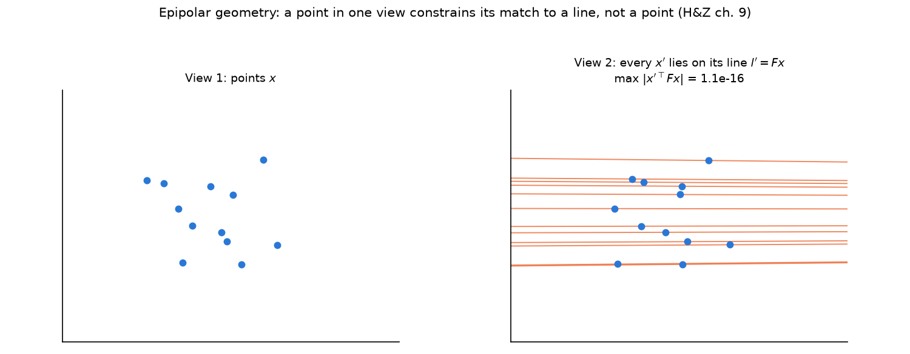
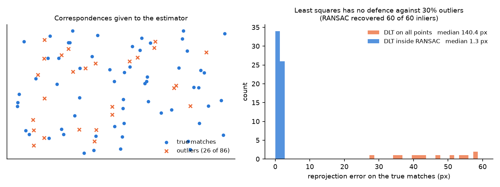

# MultipleView_Geometry_in_Computer_Vision

Notes taken while working through Hartley & Zisserman, *Multiple View Geometry in
Computer Vision* (2nd ed.). Section numbers refer to that book.

Every figure here is generated by `make_figures.py`, and each one is produced by
applying the matrix it is about rather than drawn to look right — the vanishing
point is where the transformed lines actually meet, and the RANSAC panel is a
real estimation run on real outliers.

---

# Concepts
## 1. Planar Geometry
- a. Points and lines
  - (1) Homogeneous Representation of Lines
    - l = (a, b, c)ᵀ
  - (2) Homogeneous Representation of Points
    - x = (x, y, 1)ᵀ
  - (3) Degrees of Freedom
    - The minimum number of independent variables required when an image undergoes a transformation
  - (4) Intersection of lines
    - x = l X l' (can be obtained using the cross product)
    - 

  - (5) The line joining two points
    - l = x X x' (can be obtained using the cross product)

---

- b. Ideal points and the line at infinity
  - 
  - 

  - Intersection of parallel lines
    - l X l' = (c' - c)(b, -a, 0)ᵀ (can be obtained using the cross product)
  - (1) Ideal point: a point with x3 = 0
    - x = (x1, x2, 0)ᵀ
  - (2) Line at infinity: the set of line directions in the plane
    - l∞ = (0, 0, 1)ᵀ
  - (3) A model of the projective plane
    - Geometrically, the two-dimensional projective space (P^2) is the set of all lines passing through the origin in three-dimensional space (R^3)
    - The point where a line through the origin in R^3 space intersects the plane x3 = 1 is precisely a point in P^2 space
    - 

  - (4) Duality
    - In two-dimensional projective space (P^2), points and lines possess duality (or symmetry)
      - i.e., a point x on a line l can be expressed in two ways, as xᵀl=0 or as lᵀx=0
    - That is, the formula for the line passing through two points is symmetric with the formula for the point at which two lines intersect

---

- c. Projective transformation (§2.3–2.4)
  - A projectivity is an invertible map h: P² → P² that maps collinear points to collinear points. Equivalently, x' = Hx for some non-singular 3x3 matrix H.
  - H is homogeneous: it has 9 entries but only their ratio matters, so it has **8 degrees of freedom**. Four point correspondences in general position determine it, which is why the DLT below uses four points as its minimal sample.
  - Lines do not transform the way points do. From x'ᵀl' = xᵀl and x' = Hx:
    - **l' = H⁻ᵀ l** — the line transforms by the inverse transpose. Forgetting this is the classic source of a homography that looks right on points and wrong on edges.

  - The hierarchy of 2D transformations. Each rung adds degrees of freedom and gives up an invariant, and the figure applies each matrix to the same shape:

    | Group | dof | Matrix form | Preserves |
    | --- | :--: | --- | --- |
    | Euclidean | 3 | [R t; 0ᵀ 1], R rotation | lengths, angles, areas |
    | Similarity | 4 | [sR t; 0ᵀ 1] | angles, ratios of lengths |
    | Affine | 6 | [A t; 0ᵀ 1], A invertible | parallelism, ratios of areas, l∞ as a set |
    | Projective | 8 | [A t; vᵀ w] | collinearity, incidence, **cross ratio** |

  - What separates affine from projective is the bottom row. When v = 0 the line at infinity maps to itself, so parallel lines stay parallel. When v ≠ 0, l∞ maps to a finite line and parallels converge:

  - **Vanishing point**: the image of an ideal point. A set of world lines with direction d images to lines meeting at v = K R d — which is why vanishing points recover direction and, through the image of the absolute conic, calibration (§8.6).
  - **Cross ratio**: for four collinear points, (x1,x2;x3,x4) is invariant under any projectivity. It is the only projective invariant of four collinear points and is the basis of single-view measurement.

---

## 2. Projective Geometry in 3D (§3)
- Points are x = (x1, x2, x3, x4)ᵀ in P³; a **plane** is π = (π1, π2, π3, π4)ᵀ with πᵀx = 0. Points and planes are dual in P³ — the dual of the point/line duality in P².
- **Plane at infinity** π∞ = (0,0,0,1)ᵀ. It contains the ideal point of every direction, and identifying it upgrades a projective reconstruction to an affine one.
- **Absolute conic** Ω∞: a conic on π∞ containing no real points. Its image ω = (KKᵀ)⁻¹ depends only on the internal parameters K, not on the camera's pose. Everything in autocalibration is an attempt to locate ω.
- Lines in P³ have 4 dof and no natural single-vector representation; Plücker coordinates are the usual device.
- The 3D hierarchy runs projective (15 dof) → affine (12) → similarity (7) → Euclidean (6), and reconstruction proceeds up it: structure from motion first gives projective structure, then π∞ upgrades it to affine, then Ω∞ to metric.

## 3. Camera Models (§6)
- The finite projective camera: **x = PX**, P = K [R | t], a 3x4 matrix with 11 dof (5 internal + 3 rotation + 3 translation).
  - K = [[fx, s, cx], [0, fy, cy], [0, 0, 1]] — focal lengths in pixel units, principal point, skew s (0 for real cameras with square pixels).
- The camera **centre** C is the right null vector of P: PC = 0. This is the one point that projects nowhere and is the cleanest way to extract the centre.
- Back-projection: an image point x defines a **ray** X(λ) = P⁺x + λC, not a point. The whole of two-view geometry follows from that loss of one dimension.
- Cameras at infinity (affine cameras: orthographic, weak perspective, para-perspective) arise as the limit where the last row of P becomes (0,0,0,1). They linearize the projection and are a good approximation when the depth variation is small relative to the distance.

## 4. Single View Geometry (§8)
- One view cannot recover depth, but it does recover direction. With three orthogonal vanishing points v1, v2, v3 the constraints viᵀ ω vj = 0 give enough equations to solve for ω, hence K — calibration from a single photograph of a scene with a box in it.
- A plane in the scene relates to its image by a **homography**, so metric rectification of a plane needs only the image of its line at infinity plus two circular points (§2.7).

## 5. Epipolar Geometry and the Fundamental Matrix (§9)
- The one fact everything rests on: given x in the first view, its match x' is not free. It lies on a line.
  - The ray back-projected from x images in the second view as the **epipolar line** l' = Fx.
  - **x'ᵀ F x = 0** for every correspondence. F is 3x3, rank 2, with **7 dof** (9 entries − 1 scale − 1 for det F = 0).

  - The figure builds F from two known projection matrices and then checks it: the maximum of |x'ᵀFx| over the twelve correspondences is printed on the panel, and it is at numerical zero. That is the constraint holding exactly, not approximately.
- **Epipoles**: e' = the image in view 2 of camera centre 1, and Fe = 0, Fᵀe' = 0. All epipolar lines pass through the epipole.
- Given F, the cameras can be written P = [I | 0], P' = [[e']ₓF | e'], which recovers the pair **up to a projective ambiguity** — the reconstruction is correct only up to an unknown projective transformation of space.
- **Essential matrix** E = K'ᵀ F K (§9.6). With calibrated cameras E has 5 dof, its singular values are (σ, σ, 0), and it decomposes into R and t up to four combinations; the correct one is chosen by requiring reconstructed points to be in front of both cameras (the cheirality condition).

## 6. Estimation (§4, §11)
- **DLT** for a homography. Each correspondence x ↔ x' gives x' × Hx = 0, which is two independent linear equations in the nine entries of H. Stack 2n of them into A and take the singular vector of A with the smallest singular value:
  - Ah = 0 → h = the last column of V in A = UDVᵀ
- **Normalization is not optional** (§4.4). Translate the points so their centroid is at the origin and scale so the mean distance is √2. Without it A is badly conditioned and the result degrades sharply with noise. This is the single most common reason a correct DLT implementation produces a poor homography.
- **RANSAC** (§4.7). Least squares assumes every residual comes from the same noise model, which a wrong match violates completely, so a single outlier can dominate the fit.

  - The figure runs both estimators on identical data: 60 true matches with 1 px noise plus 26 gross outliers. DLT on everything gives a median reprojection error of 140.4 px on the true matches — the estimate is worthless. DLT inside RANSAC gives 1.3 px and recovers all 60 inliers.
  - The number of samples needed is N = log(1−p) / log(1−(1−ε)ˢ) for sample size s and outlier fraction ε, which for s = 4 and 30% outliers is a few hundred iterations — cheap.
- **Algebraic vs geometric error** (§4.2). The DLT minimizes an algebraic residual because it is linear and has a closed-form solution; it is not the quantity of interest. The quantity of interest is the reprojection error, which is nonlinear, so the standard recipe is DLT for an initial estimate then Levenberg-Marquardt on the geometric cost.
- **The 8-point algorithm for F** is the same pattern: one linear equation per correspondence from x'ᵀFx = 0, normalization, then enforce rank 2 by zeroing the smallest singular value of the estimate. The rank enforcement matters — without it the epipolar lines do not meet at a common epipole.

## 7. Triangulation (§12)
- Given P, P' and a correspondence, X is over-determined: 4 equations for 3 unknowns. Because of noise the two rays do not actually intersect.
- The linear method stacks x × PX = 0 from both views and takes the smallest singular vector. It is fast but minimizes an algebraic quantity and is not projective-invariant.
- The **optimal** method minimizes reprojection error in both images, which for two views reduces to finding the roots of a degree-6 polynomial (§12.5) — a closed-form global optimum rather than an iterative one.

## 8. Bundle Adjustment (§18)
- The final step of essentially every reconstruction pipeline: refine all camera parameters and all 3D points simultaneously by minimizing total reprojection error
  - min over {Pᵢ, Xⱼ} of Σᵢⱼ d( Pᵢ Xⱼ , xᵢⱼ )²
- It is a large sparse nonlinear least squares problem. The key practical fact is the **sparsity structure**: a point is seen by few cameras, so the Jacobian is block-sparse and the Schur complement lets the point parameters be eliminated cheaply. This is what makes thousands of cameras tractable.
- It needs a good initialization and does not fix a bad one — bundle adjustment polishes, it does not rescue.

---

# Important Results
- (1) The necessary and sufficient condition for a point x to lie on a line l is xᵀl = lᵀx = x·l = 0
- (2) The intersection x of two lines l and l' is x = l X l' (X: cross product)
- (3) The line passing through two points x and x' is l = x X x' (X: cross product)
- (4) The principle of duality: every theorem of two-dimensional projective geometry has a dual theorem obtained by exchanging the roles of points and lines
- (5) Points transform as x' = Hx; lines transform as l' = H⁻ᵀl
- (6) A projectivity of P² has 8 dof and is determined by 4 point correspondences in general position
- (7) The cross ratio of four collinear points is invariant under any projectivity
- (8) The camera centre C is the right null vector of P: PC = 0
- (9) x'ᵀFx = 0 for every correspondence; F is rank 2 with 7 dof, and Fe = Fᵀe' = 0
- (10) E = K'ᵀFK has singular values (σ, σ, 0) and 5 dof, decomposing into (R, t) up to four solutions resolved by cheirality
- (11) Two views determine the scene up to a projective transformation; π∞ upgrades it to affine and Ω∞ to metric

---

## Figures
Regenerate with `python make_figures.py` (numpy and matplotlib only). Each function
computes what it draws, so the figures cannot drift away from the statements above.

## References
[1] https://www.r-5.org/files/books/computers/algo-list/image-processing/vision/Richard_Hartley_Andrew_Zisserman-Multiple_View_Geometry_in_Computer_Vision-EN.pdf
[2] https://alida.tistory.com/13
